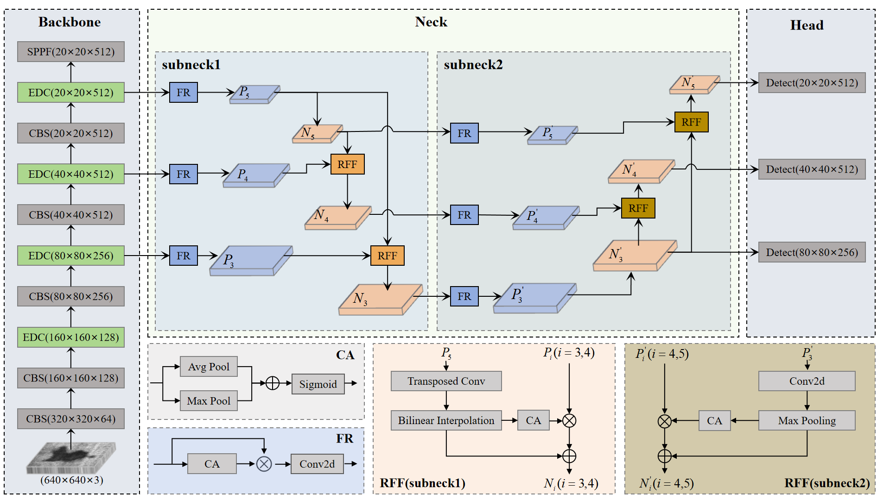

# S3Det:Strip Steel Surface Defect Detector via Enhanced Deformable Convolution and Dual Cross-Layer Pyramid

S3Det is a novel strip steel surface defect detector.

## S3Det

*Fig. 1. Overview architecture of our S3Det .*

## Experimental Environment

  python: 3.9

  torch: 1.13.1+cu117

  torchvision: 0.14.1+cu117

  timm: 0.9.8

  mmcv: 2.1.0

  mmengine: 0.9.0

during the operation, if any package is missing, install that package.

## Datasets

download the datasets; 1.[NEU-DET](https://drive.google.com/open?id=1qrdZlaDi272eA79b0uCwwqPrm2Q_WI3k), 2.[DAGM](https://conferences.mpi-inf.mpg.de/dagm/2007/prizes.html).

## results (Qualitative results)
