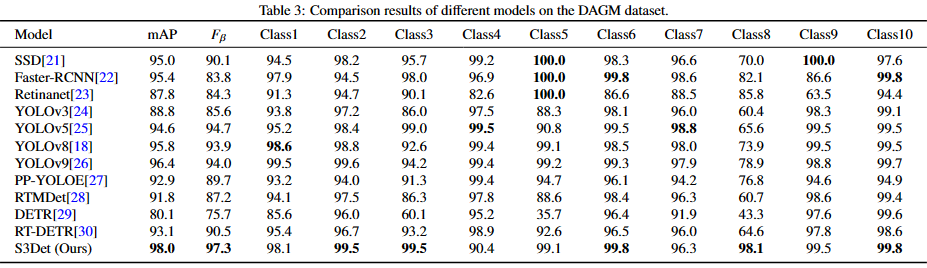

# S3Det:Strip Steel Surface Defect Detector via Enhanced Deformable Convolution and Dual Cross-Layer Pyramid

S3Det is a novel strip steel surface defect detector.

## S3Det

*Fig. 1. Overview architecture of our S3Det .*

## Experimental Environment

  python: 3.9

  torch: 1.13.1+cu117

  torchvision: 0.14.1+cu117

  timm: 0.9.8

  mmcv: 2.1.0

  mmengine: 0.9.0

during the operation, if any package is missing, install that package.

## Datasets

download the datasets; 1.[NEU-DET](https://drive.google.com/open?id=1qrdZlaDi272eA79b0uCwwqPrm2Q_WI3k), 2.[DAGM](https://conferences.mpi-inf.mpg.de/dagm/2007/prizes.html).

## results (Qualitative results)

*Table 1. Comparison results of different models on NEU-DET*

---

*Table 2 Results of ablation experiments for each module*

---

*Fig. 6. Visualization of different types of defect detection results.The first row consists of the original defect images, the second row consists of the annotated defect images, and the third row shows the results predicted by our model.*

---

*Fig. 7. Visualization of different types of defect detection results. The first row displays the original defect images, the second row shows the heatmaps generated by Squeeze-and-Excitation network, the third row presents the heatmaps generated by Coordinate Attention, the fourth row illustrates the heatmaps generated by Tripleattention, and the fifth row demonstrates the heatmaps produced by the Collaborative Attention.*

---

*Table 3. Performance comparison of different models on DAGM*
